<h1 align='center'> Hi, I'm Natalie ✨</h1>

Feel free to check out my <a href="https://nat-portfolio.netlify.app/">Portfolio</a>.

###### My Tech Stack:

****

###### Hackathon Winner 1st place ($1,000):
<!-- BLOG-POST-LIST:START -->
- [Introducing Popcorn 🍿 - A social media app for shows 📺](https://natalie.hashnode.dev/popcorn)
<!-- BLOG-POST-LIST:END -->

**** 

  
  

